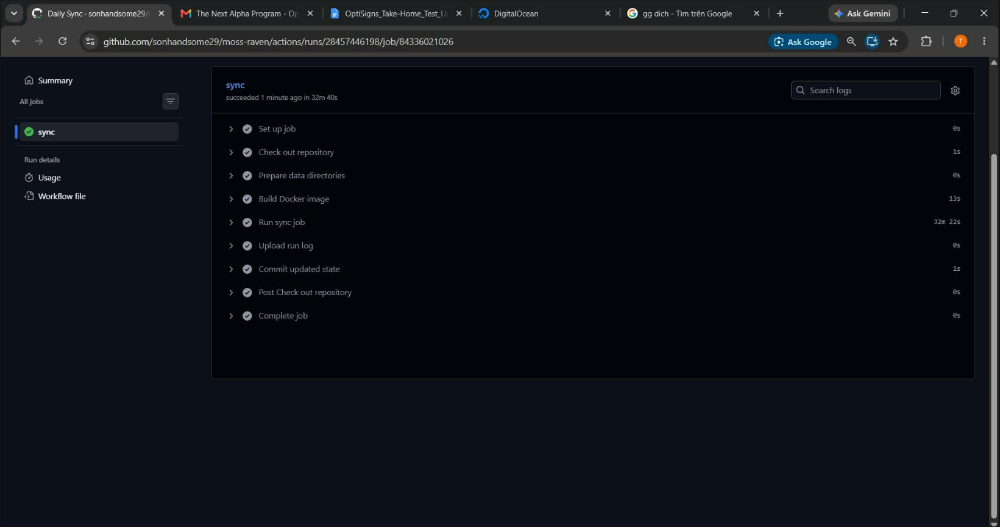
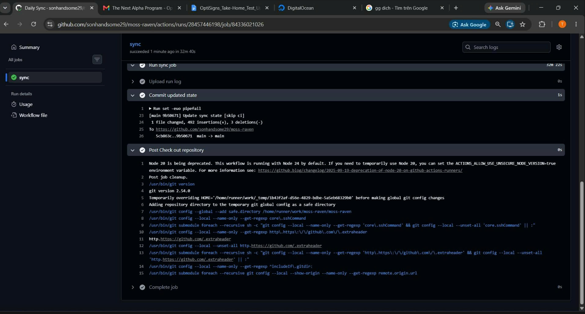

Thai Duong Son

Repo: [sonhandsome29/moss-raven](https://github.com/sonhandsome29/moss-raven)

`kb-raven` scrapes public OptiSigns support articles from Zendesk, converts them to clean Markdown, chunks them, and uploads only new or changed content to an OpenAI vector store.

## Setup

1. Copy `.env.sample` to `.env`.
2. Fill in `OPENAI_API_KEY`.
3. Optionally set `OPENAI_VECTOR_STORE_ID` to reuse an existing vector store.
4. Install dependencies with `pip install -r requirements.txt`.
5. For GitHub Actions, add repo secrets `OPENAI_API_KEY` and optionally `OPENAI_VECTOR_STORE_ID`.

## Run locally

Run `python main.py`.

The job re-scrapes Zendesk, writes Markdown to `data/articles/`, writes chunk files to `data/chunks/`, stores sync state in `data/manifests/state.json`, and logs `added`, `updated`, and `skipped`.

Chunking strategy: split by Markdown headings first, then split oversized sections by paragraph with a small overlap so support steps stay grouped for retrieval.

Docker:

```bash
docker build -t kb-raven .
docker run --rm --env-file .env -v ${PWD}/data:/app/data kb-raven
```

## Daily job logs

Platform: GitHub Actions scheduled workflow in [daily-sync.yml](https://github.com/sonhandsome29/moss-raven/blob/main/.github/workflows/daily-sync.yml)

Latest successful run: [Daily Sync run #2](https://github.com/sonhandsome29/moss-raven/actions/runs/28457446198)

The workflow runs once per day, re-scrapes Zendesk, detects deltas using stored content hashes, uploads only new or changed articles, uploads `sync.log` as an artifact, and commits the updated `state.json` so delta detection persists across runs.

Daily job screenshot:




## Assistant screenshot

Sample question: `How do I add a YouTube video?`


