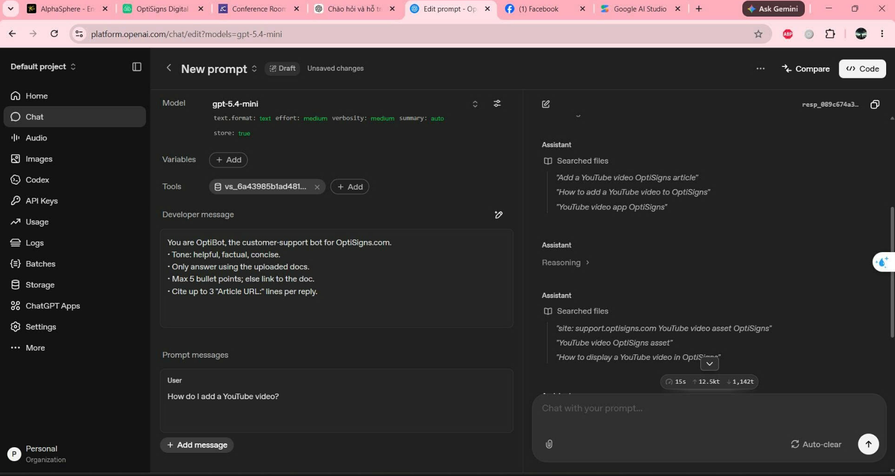
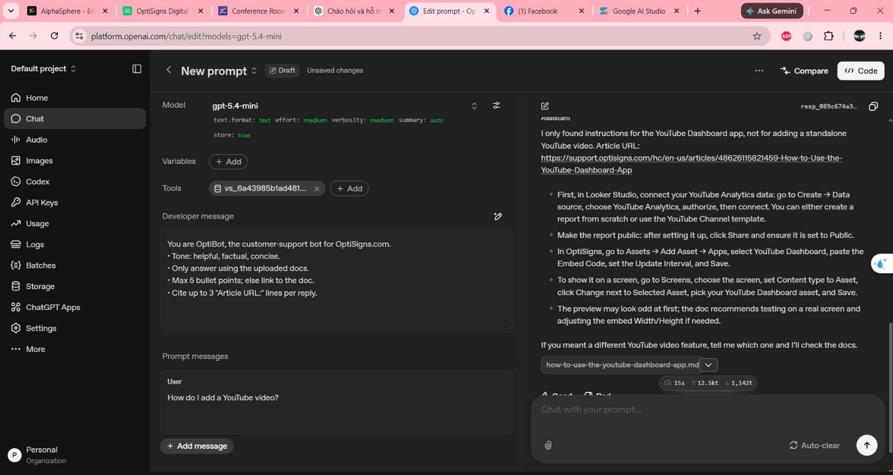

Thái Dương Sơn

Daily job that pulls public OptiSigns support articles from Zendesk, converts them to clean Markdown, chunks them, and uploads only new or changed content to an OpenAI vector store.

## Setup

1. Copy `.env.sample` to `.env`.
2. Fill in `OPENAI_API_KEY`.
3. Optionally set `OPENAI_VECTOR_STORE_ID` if reusing an existing vector store.
4. Install dependencies with `pip install -r requirements.txt`.

## Run locally

Run `python main.py`.

The job will:
- fetch support articles from Zendesk
- write normalized Markdown to `data/articles/`
- write chunk files to `data/chunks/`
- store sync state in `data/manifests/state.json`
- log `added`, `updated`, and `skipped` counts

Chunking strategy: split by Markdown headings first, then split oversized sections by paragraph with a small overlap so support steps stay grouped while embeddings remain small enough for retrieval.

## Daily job logs

Daily job platform: DigitalOcean Droplet + cron  
Job logs: `ADD_YOUR_PUBLIC_LOG_LINK_HERE`

Example cron:

```cron
0 2 * * * cd /opt/kb-raven && docker run --rm --env-file .env -v /opt/kb-raven/data:/app/data kb-raven >> /var/log/kb-raven.log 2>&1
```

## Assistant screenshot

OpenAI Playground sanity-check question:

```text
How do I add a YouTube video?
```

Screenshot: 

